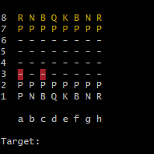
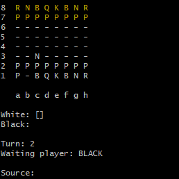

# Projeto de Xadrez

<div style="display: flex; justify-content: center;">
  
  
  
</div>

Bem-vindo ao meu projeto de xadrez! Este projeto é uma implementação simples de um jogo de xadrez que você pode jogar localmente. Se você é um entusiasta do xadrez ou quer aprender a jogar, este modelo pode te ajudar!

## Recursos

- Jogo de xadrez completo com todas as peças padrão
- Todas jogadas especiais incluidas, como en passant, promoção...
- Interface amigável e intuitiva

## Como Jogar

1. Clone este repositório para o seu computador usando o seguinte comando:

   ```bash
   git clone https://github.com/Helryson/Chess-Game.git
